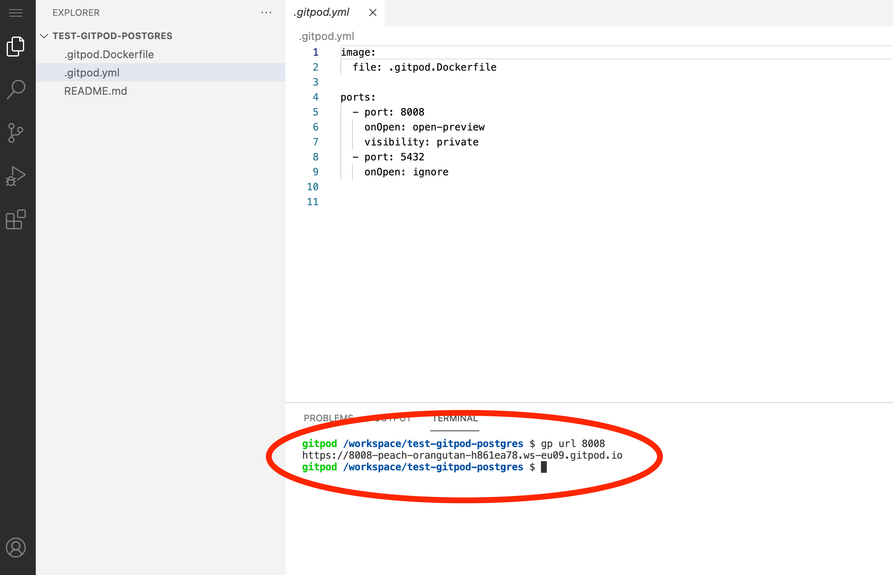
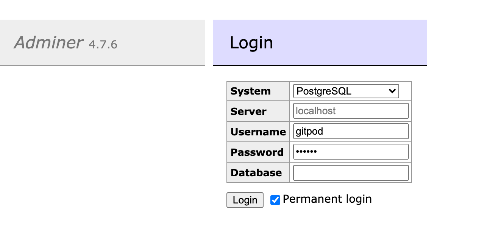

# gitpod-workspace-postgres

Extends [workspace-postgres](https://github.com/gitpod-io/workspace-images/tree/master/postgres) with [adminer](https://www.adminer.org/).

Edit your `.gitpod.yml` file as follow:

```yml
image: marcopeg/gitpod-workspace-postgres:2.6.0

ports:
  - port: 8008
    onOpen: open-preview
    visibility: private
  - port: 5432
    onOpen: ignore
```

## How does it work?

The Apache2 root folder is placed in `~/.apache` and Adminer with some
plugins are pre-configured.

> 👉 At the moment I'm working to try to setup Adminer so to automatically
> login into the local Postgres instance, but haven't figure it out just yet 🤔

## How to login?

First, get the url to your Adminer interface:

```bash
gp url 8008
```



Then, fill up the login screen with the following values:

| property |  value            |
| -------- | ----------------- |
| system   |  postgres         |
| server   |  *don't touch it* |
| username |  gitpod           |
| password |  gitpod           |
| database |  postgres         |

👉 Choose the **permanent login** option so next
time you run the workspace, you'll be able to login with just one click.


